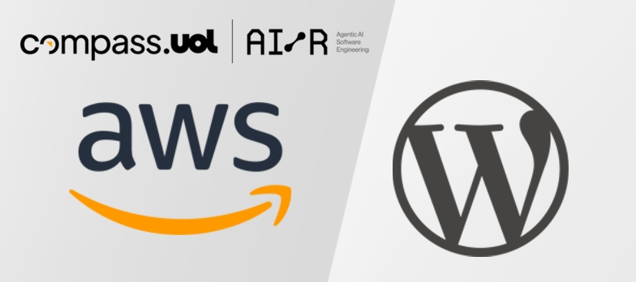
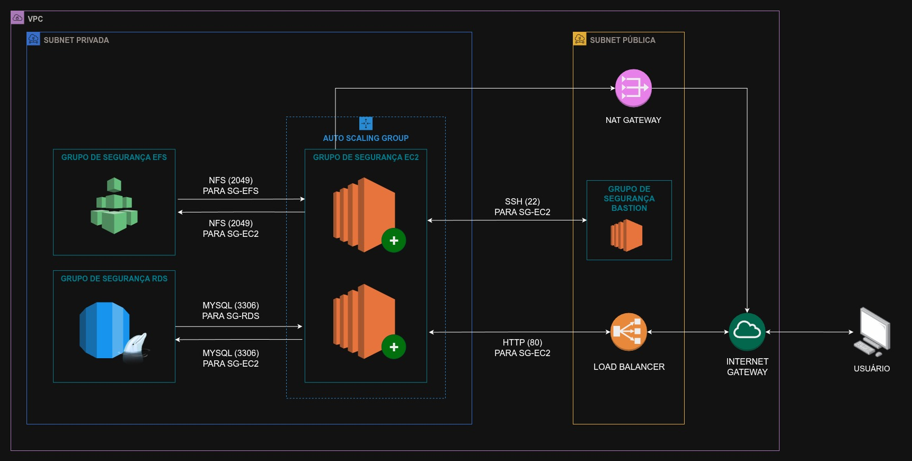
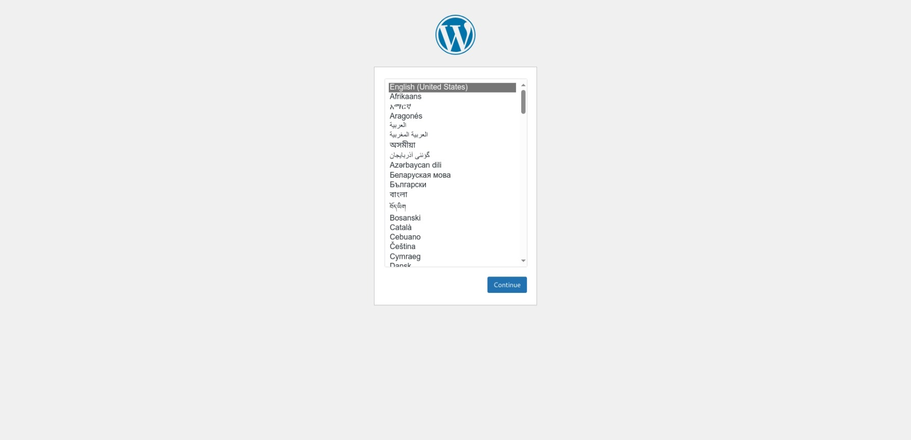

 

# 🌐☁️ Projeto DevSecOps: Worpress na AWS

Neste projeto, abordaremos a arquitetura e o passo-a-passo para implantar um sistema Wordpress no Amazon Web Services (AWS) escalável e de alta disponibilidade.

## ✅ Índice

- A arquitetura
- Recursos que serão utilizados neste projeto  
- Configurando a VPC e subnets  
- Configurando o Banco de Dados RDS  
- Configurando o volume EFS  
- Configurando os grupos de segurança  
- Configurando instância "bastion"  
- Criando modelo de execução para Auto Scaling Group  
- Configuração do Auto Scaling Group e load balancer  
- Conclusão

## 🛠️ A arquitetura
É essencial em uma arquitetura moderna disponível na web que a mesma seja resliente a falhas, altamente disponível e escalável, permitindo o seu crescimento
e que seu desempenho seja o maior possível.

Dessa forma, a arquitetura que trabalharemos neste projeto terá, dentre os principais elementos, instâncias EC2 gerenciadas por um Auto Scaling Group (ASG), com balanceamento de carga fornecido por um Application Load Balancer (ALB). Além disso, o armazenamento da aplicação será destinado a um banco de dados RDS (em single-AZ), enquanto o armazenamento de arquivos será centralizado no Amazon Elastic File System (EFS).

### 📝 Recursos que serão utilizados neste projeto

- Wordpress no Docker (wordpress:latest)
- Docker e Docker Compose;
- Amazon EC2 (Elastic Cloud Computing);
- Amazon RDS (MySQL);
- Amazon EFS;
- AWS Auto Scaling Group | AWS Load Balancer.

Assim, o objetivo neste projeto é implantar com sucesso um sistema Wordpress altamente disponível, escalável e automatizado, simulando um abiente real de produção, automatizando processos e possibilitando a compreensão de competências basilares em infraestrutura em nuvem, como scripts, provisionamento de recursos e arquiteturas resilientes, utilizando-se os recursos disponíveis na AWS.

A lógica para o provisionamento da aplicação através do Docker segue uma lógica parecida com o passo-a-passo anterior, mas em um ambiente cloud. Porém, iremos montar parte da arquitetura na AWS, para que possamos replicar o teste local em um servidor EC2 de forma automatizada, como veremos adiante.

## 🛜 Configurando a VPC e subnets

O primeiro passo neste projeto, agora no contexto de serviço em nuvem, é montar na AWS a base de toda a arquitetura, que consiste na VPC (Virtual Private Cloud) e, dentro desta, as subnets ppublicas e privadas.

A VPC é basicamente um "pedacinho" da nuvem que é separada pela AWS para o seu projeto. Dentro dela, serão confuguradas 2 subnets públicas (para Gateway de internet, bastion, NAT Gateway, etc.) mais 2 subnets privadas (para as instancias EC2, RDS e EFS). 

Essa separação é ideal para isolarmos os servidores críticos de nossa aplicação, mantendo-os isolados da internet e protegidos de eventuais tentativas de acesso malicioso.

- Passo 1: no Console AWS, digite na barra de pesquisa "VPC". Selecione a opção "VPC: Isolated Cloud Resources".

- Passo 2: em seguida, clique em "Criar VPC";

- Passo 3: clique na opção "VPC e muito mais". Essa opção cria automaticamente a tablea de rotas, facilitando o processo de montagem da VPC;

- Passo 4: Defina os seguintes parâmetros para a criação dda VPC:

>
        Nome da VPC: vpc-wordpress
        Número de subredes públicas: 2
        Número de subredes privadas: 2
        Gateway NAT: em 1 AZ
        Endpoints da VPC: Nenhuma
>

- Passo 5: Por fim, clique em "Criar VPC". O console da AWS providenciará a criação do fluxo de trabalho da VPC.

Ao final, você deverá ter uma estrutura de rede em nuvem e sub redes, com entrada saída para a internet, prota para receber as instãncias necessárias para a aplicação Web funcionar.

OBS: é __ALTAMENTE aconselhado__, caso tenha sido criado NAT Gateway e atribuído Ip elástico, que, caso não seja configuradas instâncias em subredes privadas que precisem desses recursos ambos sejam __deletados neste momento__ e recriados posteriormente, para economia de recursos na AWS. Esses dois são cobrados por GB e por hora de uso, o que pode ser um dos vilões da fatura no fim do mês.

## 🗃️ Configurando o Banco de Dados RDS

RDS, ou Relational Database Service, é o serviço da AWS responsável por, como o próprio nome diz, permitir a criação de servidores de banco de dados relacional. Dentre as principais tecnologias suportadas, temos o MySQL, MariaDB, PostGRE, Aurora (nativo da Amazon), Microsoft SQL Server, dentre outros.

Para criar um banco de dados para o Wordpress, basta seguir os seguintes passos:

- Passo 1: no console da AWS, digite na barra de pesquisa *"RDS"*. Selecione a opção *"Aurora and RDS: Managed Relational Database Service"*;

- Passo 2: No painel lateral clique em *"Bancos de dados"* e, em seguida, em *"Criar banco de dados"*;

- Passo 3: Em *"Escolher um método de criação de banco de dados"*, opte por *"Criação Padrão"*. Mais abaixo, em *"Opções do Mecanismo"*, escolha *"MySQL"*;

- Passo 4: Em *"Modelos"*, selecione *"Nível gratuito"*;

- Passo 5: Nas *"Configurações de credenciais"*, informe os seguintes parâmetros:

        - "Identificador da instância de banco de dados": database-wordpress

        - "Nome do usuário principal": admin

        - Senha principal = SenhaSuperSecreta!123

- Passo 6: Em *"Configuração da instância"*, escolha a opção *"db.t3.micro"*;

- Passo 7: em "Armazenamento", abra a lista "Configuração adicional de armazenamento" e desabilite a opção "
Habilitar escalabilidade automática do armazenamento".

- Passo 8: em "Conectividade --> Nuvem privada virtual (VPC)", escolha a VPC "VPC-Wordpress". Em "Acesso Público", opte por "Não".

- Passo 9: em "Grupo de segurança de VPC (firewall)", crie um Grupo de Segurança para controlar o acesso ao seu banco de dados, através das regras de entrada:

>
    Nome do security group: database-grupo-de-seguranca
    Regra de entrada:
        Tipo: MYSQL/Aurora
        Protocolo: TCP
        Intervalo de portas: 3306
        Tipo de Origem: Personalizado
        Origem: "id do grupo de segurança da instancia EC2" (será criada em breve)
>

- Passo 10: em "Configuração adicional --> Porta do banco de dados", certifique-se que a porta configurada é a *3306*.

- Passo 11: em "Configuração adicional --> Opções de banco de dados --> Nome do banco de dados inicial", defina o nome do banco de dados para *"wp_database"* (sem as aspas). Em "Backup", desmarque a opção "Habilitar backups automatizados".

- Passo 12: Por fim, clique em "Criar banco de dados".

Observação: podem sem atribuídos outros nomes para os parâmetros pedidos nesta seção, porém é __fundamental__ garantir que eles mantenham-se os mesmos nas próximas configurações, para evitar futuros erros de conexão com o servidor Wordpress.

## 📂 Configurando o volume EFS

O vlolume EFS será responsável por criar persistẽncia ao nosso projeto. Ou seja, alterações realizadas no Wordpress serão salvas nesse volume persistente.

Além disso, o EFS será responssável por permitir que todas as instâncias criadas em contexto de Auto Scaling Group tenham acesso aos dados já salvos, evitando reconfiguração constante.

- Passo 1: No Console AWS, digite "EFS" e selecione a opção "EFS: Managed File Storage for EC2". Em seguida, clique em "Criar sistema de arquivos";

- Passo 2: Em "Nome - opcional", você pode definir o nome do volume, por exemplo "efs-wordpress". Abaixo, selecione a VPC "VPC-Wordpress", e clique em "Criar sistema de arquivos".

- Passo 3: neste ponto, é interessante já criar o grupo de segurança próprio para o EFS; assim, será possível conectar esse volume à instancia EC2 de forma segura e confiável:

    - No Console AWS, digite e clique em "Security groups: EC2 feature";

    - Clique em "Criar grupo de segurança";

    - Em regras de saída, permita todo o tráfego, de 0.0.0.0/0;

    - Em regras de entrada, permita o tipo "NFS" (porta 2049), e a origem será o grupo de sergurança da instância EC-2 (sg-xxxxxxxxxxxxxx);

    - Defina um nome para o grupo de segurança (p. ex. "efs-grupo-de-seguranca") e clique em "Criar grupo de segurança".

## 🔒 Configurando os grupos de segurança

Os grupos de segurança são imprescindíveis para manter a arquitetura em nuvem segura. Quando bem configurados, esses grupos protegem o ecossistema da aplicação de ataques maliciosos vindos de fora.

Cada um dos ementos da arquitetura pode estar contido em um grupo de segurança, que possui seu pacote de regras de entrada e de saída. Essas regras, por princípio, são sempre **restritivas**, isto é, tudo é "proibido", salvo aquilo que que diga o contrário (regras de entrada).

Abaixo, a configuração recomendada para cada grupo de segurança:

### Grupo de segurança para instâncias em Auto Scaling Group
    - Regra de entrada 1: HTTP | Porta 80 | Origem: Origem: sg-aaaaaaaaaaaaaaaaa(grupo de segurança do load balancer)
    - Regra de entrada 2: MYSQL/Aurora | Porta 3306 | Origem: sg-zzzzzzzzzzzzzzzzz (grupo de segurança do banco de dados RDS)
    - Regra de entrada 3: SSH | Porta 22 | Origem: sg-bbbbbbbbbbbbbbbbb (grupo de segurança do servidor "bastion")
    - Regra de entrada 4: NFS | Porta 2049 | Origem: sg-yyyyyyyyyyyyyyyyy (grupo de segurança do volume EFS)

### Grupo de segurança para banco de dados relacional RDS
    - Regra de entrada: MYSQL | Porta 3306 | Origem: sg-xxxxxxxxxxxxxx (grupo de segurança das instâncias em A.S.G.)

### Grupo de segurança para volume EFS
    - Regra de entrada: NFS | Porta 2049 | Origem: sg-xxxxxxxxxxxxxx (grupo de segurança das instâncias em A.S.G.)

### Grupo de segurança do load balancer
    - Regra de entrada: HTTP | Porta 80 | Origem: 0.0.0.0/0

### Grupo de segurança para servidor "bastion"
    - Regra de entrada: SSH | Porta 22 | Origem: 123.456.78.901/32 (IP da sua máquina, para SSH)

## 🔑 Configurando instância "bastion"

Bastion é um servidor responsavel exclusivamente para acessar, via SSH, as instâncias que estão em subredes privadas, que a princípio não permitem acesso de fora.

Através dos grupos de segurança, é possível liberar o acesso excluivo pelo servidor Bastion, este com acesso liberado da internet (0.0.0.0/0 ou IP do usuário. Assim, fica mais fácil, por exemplo, o processo de resolução de problemas diretamente na instância, sem precisar torná-la pública.

Para criar, basta utilizar ass configurações básicas para uma instância EC2, porém em subnet pública e com o par de chaves .pem, necessário para acesso via SSH. Não é necessário userdata.

## 📸 Criando modelo de execução para Auto Scaling Group

O processo de criação de um Modelo de Execução é muito semelhante a criar uma instância EC2 convencional, com a diferença que desta vez, será definido um modelo que irá ser base de todas as instâncias geradas pelo ASG.

- Passo 1: Configure o modelo de execução conforme os parâmetros abaixo:

>
        Nome do modelo: <modelo-de-execucao-wordpress>
        Imagens de aplicação e de sistema operacional: Amazon Linux (qualificada para o nível gratuito)
        Imagem de máquina da Amazon: Amazon Linux 2023 (kernel-6.1)
        Tipo de instância: t2.micro (qualificada para o nível gratuito)
        Par de chaves: <sua-chave>.pem
        Firewall (grupos de segurança): <grupo-de-seguranca-do-auto-scaling-group>
>

- Passo 2: em "Detalhes avançados --> Dados do usuário (opcional)", cole ou anexe o conteúdo do *userdata*:

>
        #!/bin/bash

        # instalando docker na instancia
        sudo yum update -y
        sudo yum install docker -y
        sudo service docker start
        sudo usermod -aG docker ec2-user

        # montando sistema EFS
        sudo yum install -y amazon-efs-utils
        sudo yum install -y nfs-utils
        sudo mkdir -p /mnt/efs

        #Laço para três tentativas de montagem
        EFS_OK=false
        for i in {1..3}; do
        if timeout 30 sudo mount -t nfs4 -o nfsvers=4.1,rsize=1048576,wsize=1048576,hard,timeo=600,retrans=2,noresvport <id-do-sistema-de-arquivos>.efs.us-east-1.amazonaws.com:/ /mnt/efs 2>/dev/null; then
            echo "--> EFS montado com sucesso na tentativa $i" >> /home/ec2-user/efs.log
            EFS_OK=true
            break
        else
            echo "--> Tentativa $i de montagem do EFS falhou, continuando..." >> /home/ec2-user/efs.log
            sleep 5
        fi
        done

        #Adicionar ponto de montagem ao fstab (persistência)
        if [ "$EFS_OK" = true ]; then
        echo "<id-do-sistema-de-arquivos>.efs.us-east-1.amazonaws.com:/ /mnt/efs nfs4 nfsvers=4.1,rsize=1048576,wsize=1048576,hard,timeo=60,retrans=1,noresvport 0 0" | sudo tee -a /etc/fstab
        echo "--> EFS Adicionado ao fstab com sucesso." >> ~/efs.log
        else
        echo "--> EFS não disponível - continuando sem armazenamento compartilhado" >> ~/efs.log
        fi

        # configurando docker compose
        mkdir -p /home/ec2-user/wordpress
        sudo chown -R ec2-user:ec2-user /home/ec2-user/wordpress
        cat << EOF > /home/ec2-user/wordpress/docker-compose.yml
        services:
        wordpress:
            image: wordpress:latest
            container_name: wordpress
            ports:
            - "80:80"
            environment:
            WORDPRESS_DB_HOST: <endpoint-do-banco-de-dados>
            WORDPRESS_DB_USER: <usuario-db>
            WORDPRESS_DB_PASSWORD: <senha-db>
            WORDPRESS_DB_NAME: <nome-inicial-db>
            volumes:
            - /mnt/efs:/var/www/html
            healthcheck:
            test: ["CMD", "curl", "-fs", "http://localhost/wp-login.php"]
            interval: 30s
            timeout: 10s
            retries: 5
        EOF

        # instalando docker-compose
        sudo curl -L "https://github.com/docker/compose/releases/latest/download/docker-compose-$(uname -s)-$(uname -m)" -o /usr/local/bin/docker-compose
        sudo chmod +x /usr/local/bin/docker-compose
        sudo ln -s /usr/local/bin/docker-compose /usr/bin/docker-compose

        #Configurando permissões do ponto de montagem
        sudo mkdir -p /mnt/efs/wordpress
        sudo chown -R 33:33 /mnt/efs/
        sudo chmod -R 775 /mnt/efs/

        # rodando container app
        cd /home/ec2-user/wordpress
        docker-compose up -d
>
- Passo 3: Clique em "Criar modelo de execução".

## 🖥️ Configuração do Auto Scaling Group e load balancer 

Nesta etapa, serão configurados os modelos de execução e o Auto Scaling Group (Grupo de escalonamento automático), item imprescindível para a escalabilidade do projeto.

- Passo 1: No Console AWS, digite "EC2" e clique em "EC2: Virtual Servers in the Cloud";

- Passo 2: No painel lateral, clique em Grupos Auto Scaling --> Criar grupo do Auto Scaling;

- Passo 3: Defina um nome para o seu ASG, e selecione um modelo de execução se já possuir. Caso ainda não tenha criado, clique no link "Criar um modelo de execução". 

- Passo 4: Em "Escolher as opções de execução de instância --> Rede", escola a VPC "VPC-Wordpress", as zonas de disponibilidade **privadas**, e mantenha a opção "Melhor esforço equilibrado".

- Passo 5: Em "balanceamento de carga", é possível criar ou selecionar um load balancer ao qual será associado o ASG. Para criar um load balancer novo, selecione "Anexar a um novo balanceador de carga".

- Passo 6: Para configurar o load balancer rapidamente, basta escolher os seguintes parâmetros:

>
        Tipo de balanceador de carga: Application Load Balancer (HTTP, HTTPS)
        Nome do balanceador de carga: <nome-do-load-balancer>
        Esquema do balanceador de carga: Internet-facing
        Zonas de disponibilidade e sub-redes: <as subnets públicas do vpc>
        Listeners e roteamento: Criar um grupo de destino --> <target-group-name>
>

- Passo 7: Aqui, vamos configurar o tamanho do grupo e ajuste de escala, definindo quantas instâncias estarão ativas e o tamanho mínimo e o máximo do grupo de instâncias, conforme a necessidade.

- Passo 8: Por fim, avance as etapas e clique em "Criar grupo do Auto Scaling".

- Passo 9: Para ser permitido que se acesse a aplicação pelo load balancer, é preciso associá-lo a um grupo de segurança. Para isso, basta ir em "Load balancers --> Ações --> Editar grupos de segurança", e selecionar o SG do load balancer.

Com todos os passos concluídos, basta aguardar alguns minutos até que o provisionamento do Auto Scaling Group e da(s) instância(s) esteja concluído. Para testar o funcionamento da arquitetura, basta acessar via DNS no navegador de sua preferência:

    http://<dns-do-load-balancer>

## 🎉 Conclusão

Se você chegou até aqui, muito obrigada pela atenção. Seguindo os passos acima, é perfeitamente possível por no ar um sistema Wordpress, escalável e allto-disponível e em nuvem em poucos minutos!

Até a próxima!

